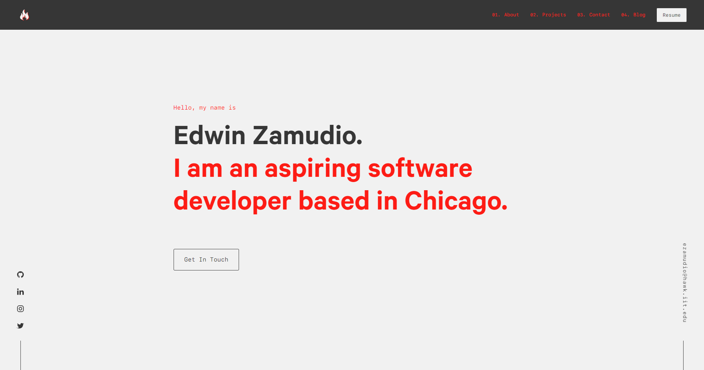

- [What about your old website](#what-about-your-old-website)
- [New Website](#new-website)
- [What is Nginx](#what-is-nginx)
- [What is Jenkins](#what-is-jenkins)
- [Other](#other)
- [Conclusion](#conclusion)

What about your old website
---------------------

For my old website, I used [Gatsby](https://www.gatsbyjs.com), which was easy to deploy thanks to [Vercel](https://vercel.com).
Vercel took every commit I published for my website repository and magically created a production website.
I now know that Vercel just made Jenkins as an online service.

New Website
------------------------------------------------------

I changed my website from using [Gatsby](https://www.gatsbyjs.com) to [Jekyll](https://www.jekyll.com). My reasoning behind it was there was alot of overhead in making that website.  
I kept thinking why am I making a complex website for a blog.
I don't have 1,000,000 hits a day nor do I have some sort of web store.  
Ya feel me?  
Anyways, Jekyll >= Gatsby for now.
Enjoy the blog posts.

What is [Nginx](https://www.nginx.com)  
----------------------------------  

According to Nginx, Nginx Open Source is "software for web serving reverse proxing, caching, load balancing, media streaming, and more."

I primarily use Nginx as a web server for this [website](https://edwin.computer). It just listens to traffic from specific ports and redirects that traffic to the appropriate location.

What is [Jenkins](https://www.jenkins.com)
-----------------------------

From the Jenkins website, "The leading open source automation server, Jenkins provides hundreds of plugins to support building, deploying and automating any project."

I primarily use Jenkins to automate the process of deploying my website to my Nginx Server.  
Using Jenkins, I can automate pulling my websites Github repository and building the website when there is a new commit, reporting the build status back to Github. That's pretty cool.

Other
------------------------------

Nginx has great documentation. I was able to set up HTTPS with an SSL certificate from [CertBot](https://certbot.eff.org/). The process was straight forward.

Conclusion
------------------------------

Documentation is your friend. I will try to make these more like guides in the future.
