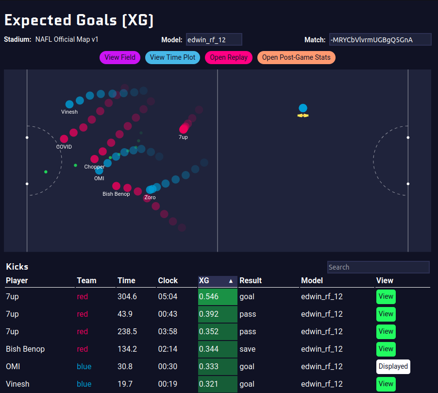
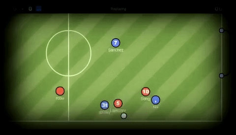
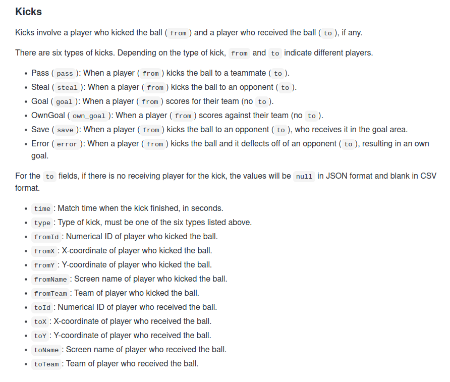
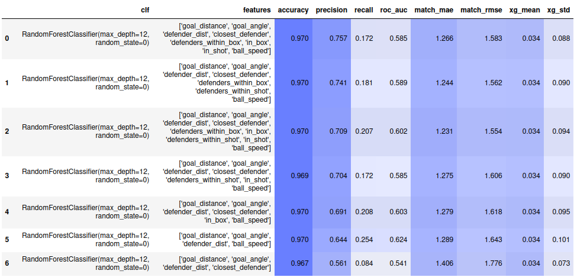
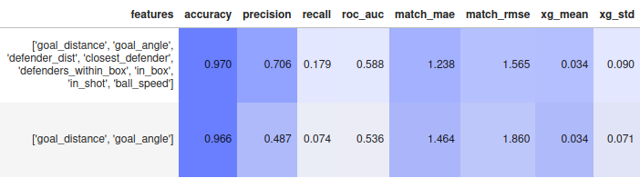
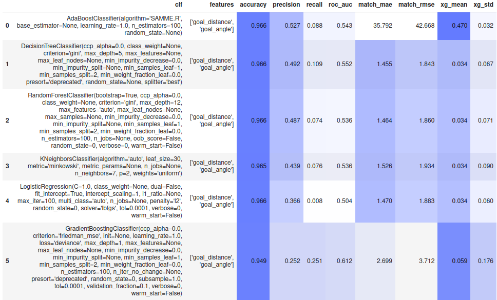
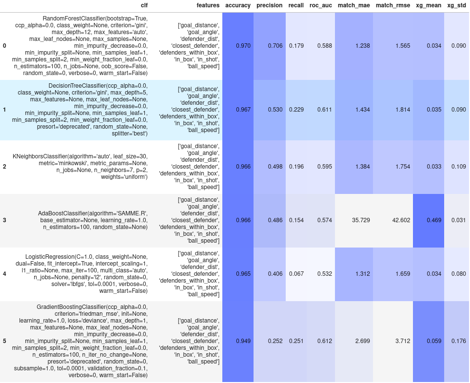

Most Machine Learning project usually go like this:

- Get a dataset
- Create a model trying to predict something
- Modify model until you get good metrics
- Profit

Luckily for you, this project is **unique** compared to most data science project.

I was able to:

- Work with a large and imperfect data set
- Create a model that performed great at the task of predicting XG(expected goals)
- Deploy the model to a website that creates visualizations
- Get feedback on my model from users of my model



Goal: Create and deploy machine learning models to predict “expected goals” (XG) in the online game [HaxBall](https://www.haxball.com/). 

I'll explain a couple of things before I get into the technical details.

## What is HaxBall

[HaxBall](https://www.haxball.com/) is an online physics-based multi-player soccer game. 

Below is a short animation of the game being played.



Each player is a circle and the controls are WASD(or arrows) to move your player and space to kick the ball. 

## What is Expected Goals(XG)?

Below is a short video explaining what expected goals means in the context of soccer.

<iframe width="560" height="315" src="https://www.youtube.com/embed/zSaeaFcm1SY" frameborder="0" allow="accelerometer; autoplay; clipboard-write; encrypted-media; gyroscope; picture-in-picture" allowfullscreen></iframe>

Summary of the video:

XG is the probability of a given kick resulting in a goal and can be used to create higher-order metrics, for both offense and defense.

XG does not attempt to solve soccer or make predictions of the game or the results but rather, if for example a team has a high cumulative XG score through the match but doesn't score any goals this would mean the team was applying pressure through the match and had a chance to score but did not score.

XG does not account for who is taking the shot, we know that elite strikers will score more than their XG suggests.

Some criticisms of XG in soccer, include undermining the value of clinical strikers. In other terms, strikers who can stay calm under pressure in positions close to the goal won't outperform their XG consistently. We know there is no such thing as a 100% chance of a goal.

## Predicting XG in HaxBall

Predicting XG using Machine Learning was a multi-step process, this was not something I could do in one sitting. *(Maybe at a hackathon with 3 red bulls.)*

Before creating a Machine Learning model, I had to do some exploratory data analysis and understand the types of data we had collected. This was part of the brainstorming part for the feature engineering I would do later. As I had a chance to see what types of data we had and how the data was obtained.

Each match contained the score, stadium, players, goals, kicks, possessions and positions. 

Here is an example of the schema for the kick which, many kicks are within the Match.



The complete data schema for the data I worked with is on [HaxClass](https://github.com/vingkan/haxclass) repository. This repository also contains the source code for Headless API that recorded data from matches. It has some instructions on how this the headless API recorded the data. I won't talk about this because I did not work on that API.

Once I had a good understanding of the data collected I started creating different features. I had to brainstorm features that would make the model better at predicting XG. I iterated on this process of brainstorming, picking and creating features and evaluation these features on the model. 

> Feature engineering is when you use domain knowledge to extract features from raw data using data mining techniques. The purpose of a feature is to make the problem easier to understand in the context of the problem. - Feature Engineering Wikipedia

I also had to draw comparisons between soccer and HaxBall to make predicting XG easier. Haxball is much simpler than a game of soccer this made the task of predicting XG a bit easier. This comes down to the fact that you can only kick the ball in HaxBall. In Soccer, you can make headers and trick shots etc.

There were a couple of ideas that stuck out to me such as defenders between the ball and the goal, the speed of the ball, the closest defender and the number of defenders within a certain range.

Below is the code for one of my features. The function is a relatively straight forward. The speed of the ball was an important feature in the model, boosting the model's precision by a significant amount. The speed of the ball is the 2nd most important feature to the model as we will later see. 

```python
def speed_ball(match,kick,offset):
    '''
    Args: match, a kick within the match, and offset to act as a small time interval
    Returns: speed of the ball
    '''
    speed = 0
    if kick["time"]>1:
        position_before = get_positions_at_time(match["positions"], kick["time"] - offset)
        position_after = get_positions_at_time(match["positions"], kick["time"])
    else:
        return 0
    ball_before = list(filter(lambda person: person["type"] == "ball",position_before))[0]
    ball_after = list(filter(lambda person: person["type"] == "ball",position_after))[0]
    distance = stadium_distance(ball_before['x'],ball_before['y'],ball_after['x'],ball_after['y'])
    time = (ball_after['time']-ball_before['time'])
    return distance/time
```

### Comparison of Models

One of the first things I did was decide on what model that was good on the dataset. This model was used to compare features. The best model by far was Random Forest Classifier, out of the box with no adjust to the parameters as well.

The method of comparing was by using preferred metrics such as accuracy, precision and recall, ROC AUC. 

While iterating over features, I had to compare the model with all and features and different combinations of the features. Here is one of the final comparisons I did. 



The final features I chose were:

- Goal Distance
- Shot Angle
- Distance of the Closest Defender
- Defenders within a certain distance of player
- Number of players within a box extending from goal
- Boolean Is there players in this box
- Boolean Is there players in a cone from the goal to the player 
- Speed of the ball over a 1-second interval.

#### My model might be good but was it good because of me?

The way to test the question above is to perform an ablation test where I remove all the features and run the model on its own.



In the image above, we have a comparison of my feature Engineered model vs the original model, where the model on no features was no better than guessing. 

The next images are the different models on feature engineered model and on the original model





The data shows that any model on the original model without feature had no real chance of predicting XG precisely.

Also, we see that random forest classifier was the only model that can precisely calculate XG by a significant margin.

Once I thought the features were good enough for the model that predicts XG, I deployed that model to the website, [Located Here](https://vingkan.github.io/haxclass/hub/).

### Why my model is a good model

As we can see above, our model is good based on metrics but why does the random forest classifier perform the best?

Let's compare Random Forest to Gradient Boost, since these are both ensemble methods and they performed the best and worst respectively at the task of predicting XG.

Ensemble learning is a machine learning paradigm where multiple weaker models are used to create a better final model.

**What is the difference between these two ensemble methods?** 

Random forest uses bagging, which focuses on learning from the weaker models independently and trying to combine them in a deterministic averaging process.

Gradient Boost uses boosting, which focuses on learning from the weaker models and trying to create the final best model in a sequential manner.

If that means nothing to you, roughly bagging focuses on averaging out the weaker models to create the final model, while boosting focuses on learning upon other features sequentially.

If that still means nothing to you, [check out this article](https://towardsdatascience.com/ensemble-methods-bagging-boosting-and-stacking-c9214a10a205)

We also have to look at the features to determine why our model is good. I believe these features worked well because they are necessary conditions for a goal to happen. You have to be close to the goal to score, there can't be players in between the goal and you when you kick the ball or else they will block the ball. 

These are just some examples of how trying to contextualize the problem made it easier for the model to predict the values of XG.


## Feedback I received

Some feedback I received had to do with some measurement error as some kicks were not recorded by our headless API.

Or so I thought, what we later found out was that the data was being collected but our method for getting the positions of the players had a bug in it causing for some kicks to be dropped.

We got complaints about the scores of XG being too low because a kick is never certain to go in even at goal lines. To the users/people we got feedback from, they believed that a value of .6 is too low. I could have done some post modeling adjustments such as making the scores higher.

## Challenges

Some of the challenges I ran into include typical Machine Learning/Software engineering issues where you don't know the value a certain feature will add so will it be better to spend more time on a feature you think will provide value or iterate quickly over a smaller feature that you think bring value.

Most of the project challenges came down to this project being crammed into 2 weeks between christmas and new years.

I had a couple features I wanted to work on such as a Fast Break, a boolean value to tell if a fast break was occurring, but my heuristic was poor or the feature was too similar to the other features thus not really having an impact of the model's performance.

There were other features I wanted to implement such as time length of a possession, and splitting the field into sectors. 

I probably could have modified the parameters for the random Forest classifier to optimize the results of the model as well.

## Things I Enjoyed about this project

Disclaimer: Data Science is not my main area of expertise. I enjoy backend web development and info/system/network security.

I was able to work one on one environment, received feedback and advice on the model and overall software engineering.

Most of the things I enjoyed were the same things that made this project unqiue such as being able to see my results on a website.

I was glad to see that my model was good at predicting XG compared to a demo model and compared to any metric. When we performed the [ablation test above](#My model might be good but was it good because of me?). We saw that the model without our features did not perform nearly as well at the task of predicting XG.

## Links and References

If you want to see the website where this my model is deployed, [you can go here!](https://vingkan.github.io/haxclass/hub/)

If you want to see some examples of my model, [here is an example](https://vingkan.github.io/haxclass/hub/xg.html?m=-MRY8jFXegyYZc7CK-5l)

If you want see some of the work I did you can check out the [HaxML repository on Github](https://github.com/vingkan/haxml)

Some of the tools I used that you are probably familiar with:

- [Jupyter notebooks](https://jupyter.org/)
- [Scikit-learn](https://scikit-learn.org/stable/#)
- [Pandas](https://pandas.pydata.org/) 
- [matplotlib](https://matplotlib.org/).
- [Flask](https://flask.palletsprojects.com/en/1.1.x/)


***Thank you to Vinesh Kannan for giving me the chance to work on this project.***